# DermGAN-DDPM Generation Pipeline

This folder contains the code that produced the synthetic images released on Mendeley Data (DOI: [10.17632/p4bst76r7w.1](https://doi.org/10.17632/p4bst76r7w.1)). The pipeline runs independently per disease class; each class subfolder contains a self-contained notebook implementing all four stages.

## Pipeline Stages

**Stage 1 — Preprocessing.** Raw images are renamed sequentially (e.g. `Cowpox_001.jpg`), resized to a uniform 256×256×3, and annotated for Region of Interest (ROI) using VGG Image Annotator (VIA). The exported JSON annotations are parsed into a semantic map per image, saved as paired `_real.png` / `_map.png` files. An augmentation pipeline (random flips, rotations, affine transforms, Gaussian noise, blur, and color/illumination jitter) is applied synchronously to both the real image and its semantic map, 30 times per source image. The augmented pairs are split 80/20 into `trainA`/`valA` (semantic maps) and `trainB`/`valB` (real images).

**Stage 2 — Convolutional Autoencoder.** A five-layer convolutional encoder compresses each 256×256×3 image to a 16×16×64 latent tensor; a mirrored decoder reconstructs the RGB image. The encoder's frozen output feeds Stage 3.

**Stage 3 — Latent Diffusion Model (DDPM).** A U-Net with sinusoidal time embeddings is trained to predict and remove Gaussian noise added to the latent tensor under a linear noise schedule (β: 1e-4 → 2e-2), producing new latent samples via iterative denoising.

**Stage 4 — Pix2Pix Refiner.** A U-Net generator (6-channel input: ROI map + coarse decoded image) refines the coarse DDPM output into a photorealistic lesion image, trained adversarially against a PatchGAN discriminator (BCE + λ=100 L1 loss). Outputs are then passed through a quality-filtering step (noise removal, sharpening, and frequency-domain filters) before being accepted into the released corpus.

## File Mapping

| Class | Notebook | Stages Covered |
|---|---|---|
| Cowpox | `cowpox/cowpox_dermgan_ddpm_pipeline.ipynb` | Autoencoder, latent DDPM, Pix2Pix refiner, quality filtering |
| Measles | `measles/measles_dermgan_ddpm_pipeline.ipynb` | Full four-stage pipeline including preprocessing/ROI/semantic map generation |

Add further class subfolders (`monkeypox/`, `chickenpox/`) following the same internal structure as additional pipeline runs are finalized.

## Requirements

See `requirements.txt`. The notebooks were developed and trained on PyTorch 2.7.1, Python 3.13, with an NVIDIA RTX 3050 Laptop GPU (6 GB, CUDA Compute Capability 8.6), CUDA 11.8, random seed 42.

## Reproducing the Pipeline

1. Set the `ROOT` path in each notebook's early cells to your local dataset directory containing `trainA`, `trainB`, `valA`, `valB`.
2. Run cells sequentially: autoencoder training, latent DDPM training, Pix2Pix refiner training, then the filtering cells.
3. Generated and filtered outputs are written to an `outputs/` directory local to your run; these are the images intended for release as the synthetic dataset artifact.

Note that file paths in the notebooks currently point to local development directories and should be updated to relative paths before wider reuse.
