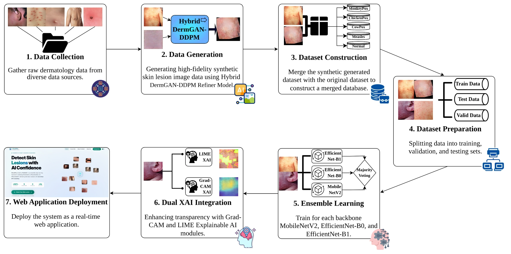

# PoxNetX: An Explainable AI-Based Ensemble Deep Learning Method for Precise Diagnosis of Skin Diseases

Undergraduate thesis project, Department of Information & Communication Technology (ICT), Comilla
University. 
Supervisor: Lecturer Khondakar Oliullah. Co-author: Syed Ashrafuzaman Annan.

## Overview

Most AI models proposed for pox-type skin lesion classification never leave the lab; PoxNetX
was built specifically to close that translation gap. It is a seven-stage, explainable ensemble
deep learning framework for five-class differential diagnosis of viral pox skin lesions:
**Monkeypox, Chickenpox, Cowpox, Measles, and Normal** skin. The project addresses six research
gaps identified in the literature (restricted multi-class scope, inadequate data quality,
narrow model evaluation, absent explainability, lack of deployment, and prohibitive
computational overhead) and ships an end-to-end pipeline from raw data collection through a
publicly deployable web application.

## Why This Project Exists

Pox-type skin diseases such as Monkeypox are frequently confused with visually similar
conditions like Chickenpox, Cowpox, and Measles, especially in resource-limited settings
without ready access to a dermatologist. Existing classifiers in the literature tend to
suffer from three-class scope, small or imbalanced datasets, black-box predictions with no
explainability, and no path to real deployment. PoxNetX tackles all four at once: five-class
scope, a generative pipeline to correct class imbalance, dual explainability at the ensemble
level, and a live web application (CheckPox) that anyone can use in a browser.

## Overall Framework
<!-- Architecture animation / demo GIF goes here, see the Media section further down for how to add it -->

  

## Pipeline at a Glance

1. **Raw Data Collection**: 1,875 images pooled from multiple online sources across five classes.
2. **Preprocessing**: renaming, resizing, ROI annotation (VGG Image Annotator), semantic map
   creation, targeted 30x augmentation for the most underrepresented classes (Cowpox, Measles),
   and an 80/20 train/validation split.
3. **DermGAN-DDPM Refiner**: a four-stage hybrid generative pipeline (convolutional autoencoder,
   latent DDPM, Pix2Pix refiner) producing 15,666 synthetic images across all five classes.
4. **Transfer Learning Sweep**: 20 architectures across six CNN families benchmarked on the
   augmented dataset.
5. **EL03 Ensemble**: MobileNetV2, EfficientNetB0, and EfficientNetB1 combined via hard majority
   voting, trained on the unaugmented, curated `Dataset_Raw`.
6. **Dual XAI**: Grad-CAM and LIME applied at the ensemble level, not per individual model.
7. **CheckPox Web Application**: FastAPI + ONNX Runtime + MySQL + Groq/LLaMA 3, deployed on
   Microsoft Azure.

## Key Results

| Metric | Value |
|---|---|
| Accuracy | 94.06% |
| Macro F1 | 0.9409 |
| Cohen's Kappa | 0.9257 |
| Macro-averaged AUC | 0.9937 |
| Parameters | 16.5M |
| CPU latency (classification only) | ~210 ms |
| CPU latency (with full XAI) | ~12.1 s |

DermGAN-DDPM contributes to the transfer learning sweep, not to EL03's final training data;
see `ensemble_learning/README.md` for why that distinction matters when reproducing results.

## Repository Structure
.  
├── assets # All assets for repository  
├── Data # Synthetic data generation  
├── Documents # Thesis documents  
├── Ensemble Learning # All Ensemble Configurations  
├── PoxNetX_Results # Results of PoxNetX Model  
└── Transfer Learning # All Transfer Learning Models  

## 👤 Authors
### Supervisor  
**Khondokar Oliullah**
Lecturer, Department of ICT, Comilla University
🔗 [Website]([https://github.com/rifat-cou](https://sites.google.com/view/khondokar-oliullah/home))

### Team Members  
**Mohammad Rifatul Islam Marof**
Department of ICT, Comilla University
🔗 [GitHub](https://github.com/rifat-cou)  

**Syed Ashrafuzaman Annan**
Department of ICT, Comilla University

